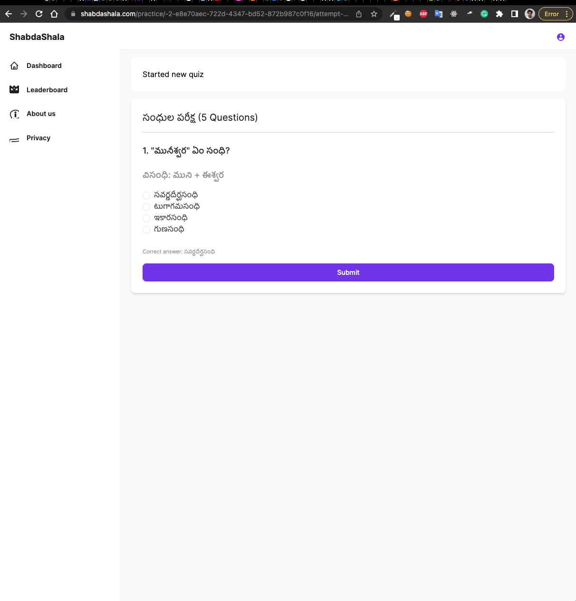

# ShabdaShala

`ShabdaShala` is an online assessment and competing tool that enables language learners to take multiple instructor created quizzes.

## About Us:
A microstartup that builds the technical tools needed to easily teach, learn and research languages. Currently we provide basic tools for  We are 100% open-source.

## Features:

### Instructor's Perspective

[x] An Instructor can create multiple Learning Subjects.
[x] An Instructor can add a Question Bank (multiple questions) to a Learning Subject.
[x] An Instructor can configure a dynamic quiz with various MCQ options for a Question Bank.
[ ] An Instructor can view high level statistics (number of views, number of quizzes taken by learners, success rate and, etc...)

### Learners Perspective
[x] A Learner can read about various subjects.
[x] A Learner can prepare for quiz from Question Bank.
[x] A Learner can take quizzes with dynamic MCQs and options.
[x] A Learner can view the top performers using Leaderboards.
[ ] A Learner can take quizzes with spaced repetition technique.

### Pages

1. Dashboard Page

2. All Questions in a Page

3. Take Quiz Page

4. MCQ Question Pages

5. Exam results page

6. Leaderboard Page

